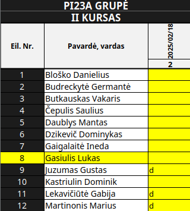

# React + TypeScript + Vite


## How it works 

You select a excel file with students and attendence.
Attendence should be marked d.

### You must set up your first sheet like this:



# To run the project:

```js
// eslint.config.js
npm install
npm run dev
```
